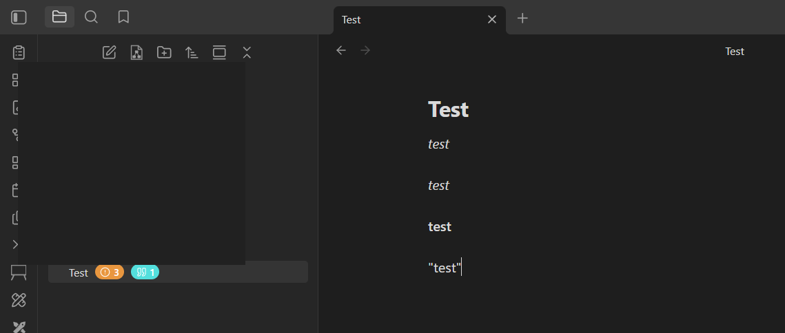
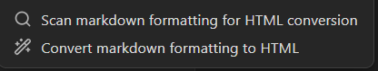
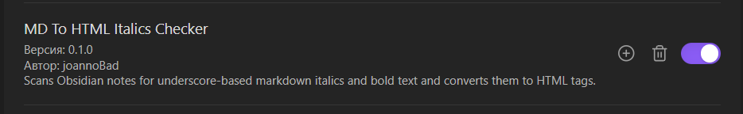
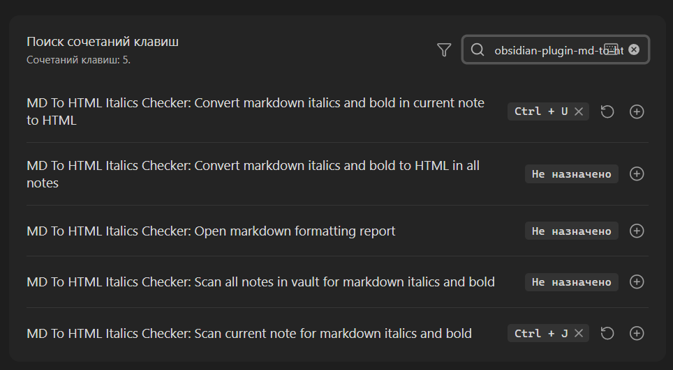

# ObsidianPlaginMdToHTML

Obsidian plugin that checks notes for markdown formatting and straight double quotes and converts them to HTML tags and guillemets.

## Quick install

1. Download the release archive or copy these files from the project:
   `manifest.json`, `main.js`, `styles.css`
2. Put them into your vault here:
   `.obsidian/plugins/obsidian-plugin-md-to-html/`
3. Open Obsidian:
   `Settings -> Community plugins`
4. Disable `Restricted mode` if needed, then enable the plugin.
5. Run `Reload plugins` or restart Obsidian.

## What it does

- scans the active note or the whole vault for underscore-based markdown formatting
- shows an issue badge near notes in the File Explorer when formatting is found
- shows separate issue badges in the File Explorer:
- orange for markdown formatting
- blue for straight quotes
- adds actions to the note right-click menu in the File Explorer
- adds a report panel with all problematic files and quick actions
- skips fenced code blocks
- skips inline code fragments wrapped in backticks
- converts `_text_` to `<i>text</i>`
- converts `*text*` to `<i>text</i>`
- converts `**text**` to `<b>text</b>`
- converts `"text"` to `«text»`
- works in the current note or across the whole vault

## Commands

- `Scan current note for underscore italics and bold`
- `Convert underscore italics and bold in current note to HTML`
- `Scan all notes in vault for underscore italics and bold`
- `Convert underscore italics and bold to HTML in all notes`
- `Scan current note for straight quotes`
- `Convert straight quotes in current note to guillemets`
- `Scan all notes in vault for straight quotes`
- `Convert straight quotes to guillemets in all notes`

## File Explorer integration

- notes with matching markdown formatting get a badge with the number of issues
- orange badge: markdown formatting issues
- blue badge: straight quote issues
- right click a note to scan it or convert it
- right click multiple selected notes to scan or convert them in batch

## Report view

- open `Open markdown formatting report` from the command palette
- or click the new ribbon icon in the left sidebar
- review all files with issues in one panel
- open a file or convert it directly from the report

## Screenshots

All note and folder names in the screenshots below are redacted.


File Explorer badges: the orange indicator shows markdown formatting issues, and the blue indicator shows straight quote issues for the same note.


Right-click menu actions: markdown formatting and straight quotes now have separate scan and convert actions in the note menu.


Plugin enabled in Community Plugins: this is how the plugin appears in Obsidian settings after installation.


Hotkeys: the command list now includes separate actions for markdown formatting and straight quotes.

## Development

```bash
npm install
npm run build
```

Then copy `manifest.json`, `main.js`, and `styles.css` into:

```text
<your-vault>/.obsidian/plugins/obsidian-plugin-md-to-html/
```

Enable the plugin in Obsidian Community Plugins.
